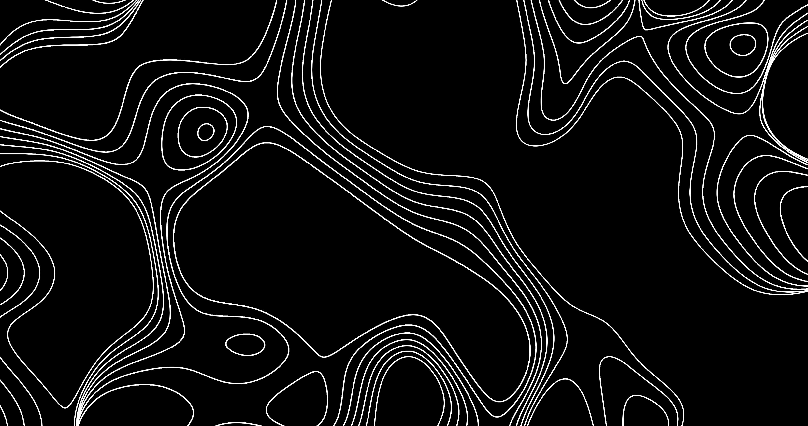
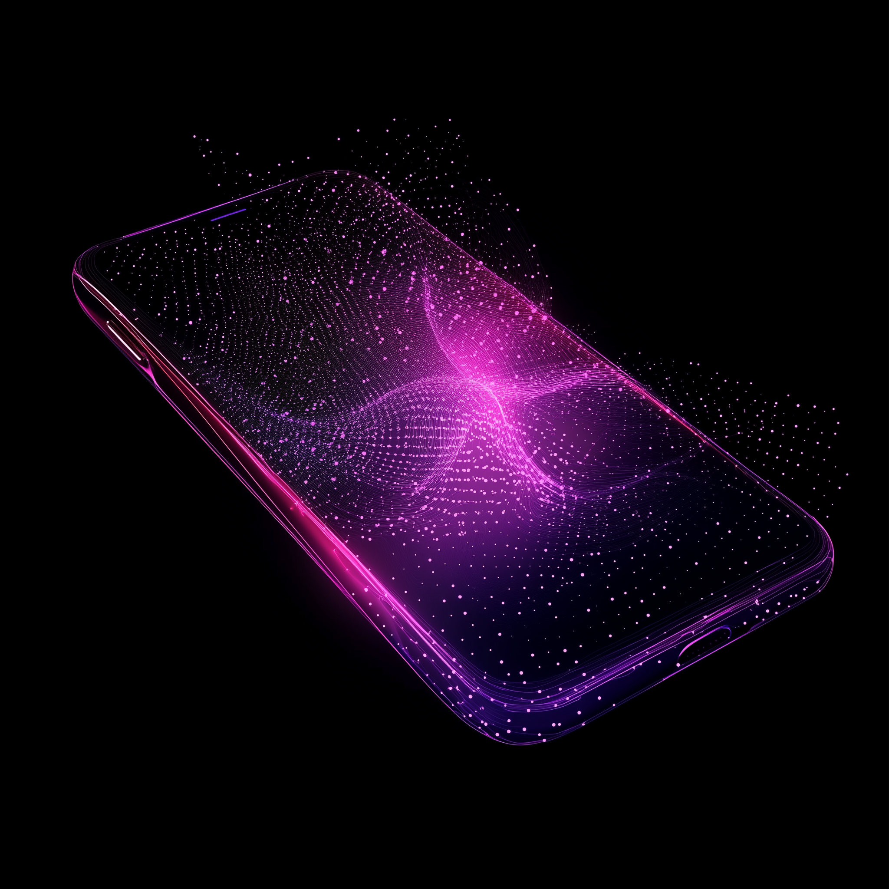

<div align="center">
  

  <h1>Telepat Design System</h1>

  A React + TypeScript component library implementing the Telepat brand — dark-first, paired-glow atmospheric design — with full Storybook documentation.
</div>

---

## Visual identity

<table>
  <tr>
    <td width="33%" align="center" bgcolor="#000000">
      <br/>
      <sub><b>Logomark</b><br/>pink → magenta gradient</sub>
    </td>
    <td width="33%" align="center">
      <br/>
      <sub><b>Hero backdrop</b><br/>topographic lines + paired glow</sub>
    </td>
    <td width="33%" align="center">
      <br/>
      <sub><b>Vision motif</b><br/>magnetic field + eclipse silhouette</sub>
    </td>
  </tr>
</table>

### The three service pillars

<table>
  <tr>
    <td width="33%" align="center"></td>
    <td width="33%" align="center"></td>
    <td width="33%" align="center"></td>
  </tr>
  <tr>
    <td align="center"><sub><b>AI Software Development</b></sub></td>
    <td align="center"><sub><b>AI Visuals &amp; Voice</b></sub></td>
    <td align="center"><sub><b>Security &amp; Infrastructure</b></sub></td>
  </tr>
</table>

### Brand color pair

| | | |
|---|---|---|
|  |  |  |
| `#4F4BFF` electric blue | `#DB4BFF` magenta | `#5A3ECC` violet CTA |

The electric-blue / magenta pair drives every dark surface — large translucent disks bleed off the top-right and bottom-left corners. No `filter: blur()` — just big translucent circles.

---

## Quick start

```bash
npm install telepat-design-system
```

```tsx
import "telepat-design-system/styles.css";
import { Button, TextInput, Nav, TestimonialCard } from "telepat-design-system";
import { Hero, ContactSection } from "telepat-design-system/sections";

export function App() {
  return (
    <>
      <Hero />
      <ContactSection onSubmit={(values) => console.log(values)} />
    </>
  );
}
```

### Fonts

The library bundles **Montserrat Alt1** (the TELEPAT wordmark face). **Poppins** must be loaded by the host application — typically via Google Fonts:

```html
<link rel="stylesheet" href="https://fonts.googleapis.com/css2?family=Poppins:ital,wght@0,300;0,400;0,500;0,600;0,700;1,300&display=swap">
```

---

## What's in the library

### Atoms

`Button` · `TextInput` · `Textarea` · `Select` · `DateInput` · `Checkbox` · `Radio` · `SegmentedControl` · `Toggle` · `Slider` · `Chip` / `Chips` · `Dropzone` · `Logo` · `LinkMore` · `Eyebrow` · `NavLink` · `GlowBackground`

### Molecules

`Nav` · `Footer` · `TestimonialCard` · `TestimonialCarousel` · `ServiceRow` · `ServiceCard` · `ClientGrid`

### Sections

`Hero` · `ServicesSection` · `CustomersSection` · `VisionSection` · `ContactSection`

Sections are published under a **separate entry point** (`telepat-design-system/sections`) so apps that only need atoms don't pull in the bundled section imagery.

```tsx
// Atoms / molecules only — tiny bundle (~12 kB ESM + tokens)
import { Button } from "telepat-design-system";

// Adds page-level sections + their imagery
import { Hero } from "telepat-design-system/sections";
```

---

## Brand principles

- **Dark-first.** Surfaces default to `#000` or `#14102B` deep purple-black.
- **Paired radial glow.** Every dark surface carries a translucent blue disk top-right and a magenta disk bottom-left. Composable via `<GlowBackground />`.
- **No emoji, no exclamation marks, no shadows.** Atmospheric depth comes from glow + `mix-blend-mode: lighten`.
- **Type.** Poppins Light (300) is the default weight; italic is reserved for vision/quote moments. The wordmark uses Montserrat Alt1 Medium with `+0.080em` tracking.

See `src/styles/tokens.css` for the full token set.

---

## Development

```bash
npm install
npm run dev              # Storybook at http://localhost:6006
npm run build            # build the library to dist/
npm run build-storybook  # static Storybook to storybook-static/
npm run typecheck
```

Storybook is the source of truth for browsing every component, every state, and every foundation specimen (Colors / Typography / Spacing / Brand).

---

## Project files

- `src/components/atoms/` — primitives (each: `.tsx` + `.module.css` + `.stories.tsx` + `index.ts`)
- `src/components/molecules/` — composed pieces
- `src/components/sections/` — page-level templates
- `src/stories/Foundations/` — design-token specimens
- `src/styles/tokens.css` — full token set (colors, type, spacing, radii, glow)
- `src/styles/fonts.css` — `@font-face` for Montserrat Alt1
- `src/assets/` — logos, hero PNG, service imagery, magnetic-field PNG, use-case photos
- `vite.config.ts` — library build (ESM + CJS + d.ts, two entry points)

For contributor / agent guidance, see [AGENTS.md](./AGENTS.md).

---

## Caveats

- Client logos in `ClientGrid` are styled-type approximations of T-Mobile, Microsoft, ProSiebenSat.1, Viasat, RH, PagerDuty, Honda, eightTV. Replace with licensed SVGs in production.
- Montserrat Alt1 is licensed — confirm redistribution rights before publishing publicly.
- Hover and press states are extrapolated defaults (not in the source Figma). Adjust to taste.
